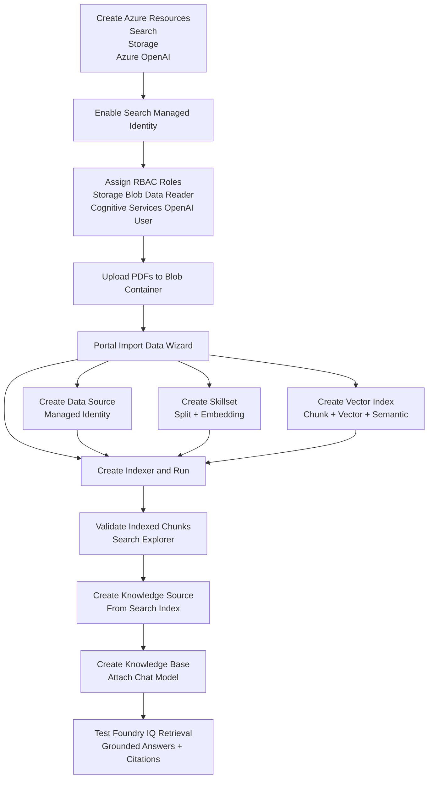

# Manual Portal Setup Guide (Keyless)

This guide explains how to manually set up Azure AI Search + integrated vectorization + Foundry IQ knowledge objects in the Azure portal, without using API keys, SAS, or storage connection strings.

## Scope

You will create or configure:
- Azure AI Search indexer pipeline objects: data source, skillset, index, indexer
- Chunking and embeddings via integrated vectorization
- Knowledge Source and Knowledge Base for Foundry IQ / agentic retrieval

## Setup Flow Chart

## 1. Prerequisites

Make sure you have these resources:
- Azure AI Search service (Basic tier or higher recommended)
- Azure Storage account with a Blob container containing PDFs
- Azure OpenAI resource (created in Azure portal) with:
  - Embedding deployment (for example `text-embedding-3-large`)
  - Chat deployment (for example `gpt-5-mini`)

Recommended:
- Keep Search, Storage, and Azure OpenAI in the same region.

## 2. Enable Identity on Search

1. Open Azure portal.
2. Go to your Azure AI Search service.
3. Open `Identity`.
4. Set `System assigned` to `On`.
5. Save.

## 3. RBAC Role Assignments (Keyless)

Assign roles to the **Search service managed identity**:

1. On the Storage account:
- Role: `Storage Blob Data Reader`
- Scope: the storage account (or narrower scope if preferred)

2. On the Azure OpenAI resource:
- Role: `Cognitive Services OpenAI User`
- Scope: the Azure OpenAI resource

Assign roles to **your user** (for portal setup and testing):

1. On Search service:
- `Search Service Contributor`
- `Search Index Data Contributor`
- `Search Index Data Reader`

Notes:
- Role assignment propagation can take a few minutes.
- If a step fails with authorization errors, recheck role scope and wait briefly.

## 4. Upload PDFs to Blob

1. Open your Storage account.
2. Go to `Data storage` -> `Containers`.
3. Create/select a container.
4. Upload PDF files.

## 5. Create Integrated Vectorization Pipeline (Portal Wizard)

1. Open your Search service.
2. Select `Import data`.
3. Choose the RAG/vectorization flow.

### 5.1 Connect to data

1. Data source: `Azure Blob Storage`.
2. Select subscription, storage account, and container.
3. Authentication: `Managed identity` (system-assigned).
4. Optional: enable deletion tracking if your storage soft-delete policy is configured.

### 5.2 Vectorize text

1. Provider: `Azure OpenAI`.
2. Select your Azure OpenAI resource.
3. Select embedding deployment (same model used for indexing/query vectorization).
4. Authentication: `System assigned identity`.

### 5.3 Advanced settings

1. Keep or adjust chunk settings (if exposed by your portal build).
2. Enable semantic ranking.
3. Keep generated chunk/vector fields.

### 5.4 Create

1. Enter an object prefix.
2. Create resources.

The wizard creates:
- Data source
- Skillset
- Index
- Indexer

## 6. Run and Validate Indexer

1. Search service -> `Indexers`.
2. Open the created indexer and run it.
3. Wait for status `Success`.
4. Check document count in the index.

Troubleshooting tips:
- If indexer fails on access: confirm Storage RBAC for Search managed identity.
- If embedding calls fail: confirm OpenAI RBAC and deployment/model selection.
- If throughput is slow: retry later or tune schedule/capacity.

## 7. Create Knowledge Source and Knowledge Base

Depending on tenant/UI availability, use Azure portal preview surfaces or Microsoft Foundry portal.

### 7.1 Knowledge Source

1. Create a `Search index knowledge source`.
2. Select the index created by the wizard.
3. Map source/citation fields (for example `chunk_id`, `title`, `parent_id`, or equivalent generated fields).

### 7.2 Knowledge Base

1. Create a knowledge base.
2. Attach the knowledge source.
3. Configure model/deployment for answer synthesis (chat model, e.g., `gpt-5-mini`).
4. Set answer mode/instructions for grounded answers with citations.

## 8. Verify End-to-End

1. In Search Explorer, run a hybrid/vector query and confirm chunked results.
2. In the knowledge base test experience, ask a question and verify:
- grounded answer quality
- citations are present and traceable to source documents

## 9. Operational Recommendations

- Keep this setup keyless end-to-end (identity + RBAC only).
- Put indexer on a schedule to pick up new/changed blobs.
- Use soft-delete handling to avoid stale chunks.
- Monitor indexer execution history and OpenAI quota usage.
- Use separate embedding deployments for indexing and heavy query workloads if needed.
